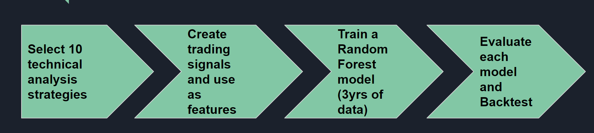

# Project 2: Bitcoin AlgoTrader with Twitter Sentiment Analysis
### Creating an Algotrader using 10 Technical analysis indicators and Twitter sentiment

Code developed by Brendan Shanley, Eli Sakkal, Manny Russel, Nika Chan, and Pablo Cisilino

### Table of Contents
1. [Introduction](#Introduction)
2. [Technical Analysis](#TA)
    - a. [Analytical Process](#Process)
    - b. [Individual Indicators](#Individual)
    - c. [Combined 5 Indicators](#Combined_5)
    - d. [Combined 10 Indicators](#Combined_10)
    - e. [TA Conclusion: The best indicator](#best)
3. [Twitter Sentiment Analysis](#Twitter)
    - a. [Analytical Process](#Proccess_sen)
    - b. [Influencers and News on Twitter](#pick)
    - c. [Results: Influencer vs News](#results)
    - d. [Sentiment Tools: Vader vs Textblob](#Tools)  
    - e. [Sentiment Analysis Conclusion](#Sentiment)
4. [Technical Analysis Dashboard](#Dashboard)
5. [Twitter Livestream](#Livestream)
6. [Limitations and What can be Improved](#Conclusion)
7. [All about Data](#Data)
    - a. [How we cleaned our data](#data_clean)
    - b. [Data sources](#data_source)
8. [Considerations for Grading](#Grading)
    - a. [Fulfillment of project requirements](#requirement)
    - b. [Who did what](#who)
9. [Appendix](#Appendix)

## 1. Introduction 
    
In this project, we created a Bitcoin algotrader using machine learning techniques we learned in class. We wanted to know which indicators can be used as a trading signal for profitable Bitcoin trades. The trading signals that we chose to analyze were 10 different technical analysis indicators with an intent to include sentiments from Twitter as an additional indicator. 

## 2. Technical Analysis 

### a. Analytical Process 
To create the algotrader, we selected 10 widely used indicators from the Technical Analysis library in Python. We then converted these indicators into buy/sell signals and used them as features in our machine learning model. 

We used a random forest model to build our predictive model because this ensemble learning method is good at avoiding overfitting. In addition, the random forest would make it very easy for us to see the relative importance of each indicator when combined. The focus of the project was to answer whether the combined indicators work better than individual indicators so we tested the indicators individually and combined to see which had the best results.

### b. Individual Indicators 

Below is a list of the 10 technical analysis momentum and volume indicators that were used. Some of them we learned in class and some are new indicators that we wanted to test. (Description for each indicator cane be found in the Appendix).The individual indicators returned accuracy rates of .50 to .60.

| Indicators |  |
| ------ | ----------- |
| - Exponential Moving Average (Price)  |- Chaikin Money Flow (CMF)   |
| - Exponential Moving Average (Volume) | - Vortex Indicator |
| - Bollinger Bands   | - Keltner Channel  |
| - Moving average convergence divergence (MACD)   | - Aroon Indicator  |
| - Relative Strength Index (RSI)   | - Ichimoku Cloud  |

### c. Combined 5 Indicators 

Out of the 10 indicators, the most important features came from these 5 indicators (Vortex, Bollinger Bands, RSI, CMF and Keltner). We combined these 5 indicators, ran it through a random forest classifier and the accuracy results were slightly better than most indicators tested individually at 0.57

**Most important Features**

**Results of combining 5 top features**

### d. Combined 10 Indicators 

We were not satisfied with the results of the 5 combined indicators, so we combined all 10 indicators and ran the same random forest classifier to see its predictive accuracy. We got the best accuracy results from combining all 10 indicators. The accuracy has gone up to 0.62.

**Results of Combining all 10 features indicators**

### e. Technical Analysis Conclusion: The best indicator 

Comparing different combindations of indicators, we concluded that using all 10 indicators together produced the best predictive results. If we invested $100,000 in Bitcoin in Feb 2018 and followed all the buy/sell signals from our algotrader, we would have made $350,000. 

**Algotrader results with $100,000 investment**

Admittedly, even though the algotrader made money in Bitcoin trading, the predictive accuracy was not that high and buying and holding Bitcoin from Feb 2018 would have yielded a larger profit. We learned that including 10 indicators is better than using 1 indicator but concede that the algotrader needs more data and model tweaking.

------

&nbsp;

## 3. Twitter Sentiment Analysis 

### a. Analytical Process 

After creating the algotrader with 10 technical analysis indicators, we wanted to use our newfound Natural Language Processing skills by checking whether Bitcoin sentiments in Twitter can be used as an additional trading signal.  

We used the Twitter API but it had many limitations that we had to work around with. Twitter API only allowed us to get 3,200 tweets per user OR 7 days of unlimited tweets on a specific search term. Since we were interested in the relationship between sentiment and Bitcoin price over time, we chose to get the 3,200 tweets each of 5 Bitcoin influencers and 5 cryptocurrency news agencies. This amounted to 32,000 tweets and had the added benefit of removing Bitcoin spam tweets.

### b. The Influencers and News outlets we picked 

We picked 5 Bitcoin influencers who had at least 500,000 followers and were active on Twitter with specific tweets regarding Bitcoin and cryptocurrency. 

| Influencer |Followers | Self Description | 
| ------ | ----------- |----------- |
| Vitalik Buterin  |1 million   |Ethereum Founder   |
| Charlie Lee | 842 k | Creator of Litecoin. Cryptocurrency Enthusiast. Ex-Director of Engineering at Coinbase.|
| Roger K Ver | 623 k | World's first Investor in Bitcoin startups including http://Bitcoin.com, http://Blockchain.com, Ripple, http://Z.cash, BitPay, Kraken, http://Purse.io & more!.|
| Andreas  Antonopoulos| 541 k | Bitcoin & Open Blockchains, since 2012. Author of 5 books.|
| Anthony  Pompliano   | 473 k | I do dope stuff in real life. Have invested $100M+ in early stage companies, including multiple unicorns. Write a daily letter to 100k investors: http://pompletter.com|
||||

In addition to the influencers above, we also took tweets from news outlets in Twitter that focused on Bitcoin or cryptocurrency. Influencers might be biased towards Bitcoin so we thought it would be good to include sentiment from the News as well. 

| News Agency |Followers | Self Description | 
| ------ | ----------- |----------- |
| Coin Desk |958 k   |Welcome to the conversation on the future of money and Web 3.0.  |
| Coin Telegraph | 595 k | The leader in Bitcoin, Ethereum & blockchain news.|
| Bitcoin News | 626 k | Official Twitter account for http://news.bitcoin.com. Follow us for all the latest Bitcoin news and services! Follow @bitcoincom for all http://bitcoin.com updates.|
| Bitcoin| 1.2 M | Bitcoin is an open source censorship-resistant peer-to-peer immutable network. Trackable digital gold. Don't trust; verify. Not your keys; not your coins.|
| Bloomberg Crypto  | 212 k | A look at how cryptocurrencies and blockchain are reshaping our world from Bloomberg @business|

### c. Results: Influencer vs News 

We used both TextBlob and Vader to get polarity scores and plotted them against the Bitcoin price from Feb 2018 to Jan 2021. The polarity scores were generally higher for influencers compared to the news outlets, suggesting a more optimistic view towards Bitcoin. There is also no clear pattern over time, tweets ranged widely from day to day while the Bitcoin price was more stable and had a clear trend that was not mirrored in the tweet sentiments of both Influencer and News Agencies

We then calculated the correlation between the Bitcoin closing price and individual and combined influencers and news outlets. As we can see from the chart below, the combined influencers have a miniscule .02 correlation with the price, whereas the combined news has a slightly higher correlation of 0.12 to bitcoin prices. Interestingly, the highest correlation was with Vitalik Buterin who is the creator of Ethereum and also has the highest follower count amongst influencers. 

### d. Sentiment tools: TextBlob vs Vader 

We decided to dig deeper into the polarity scores because we were not satisfied with the correlation results. We were surprised to see how "lacking" both of these sentiment tools were. The first example is a tweet that showed very different results betweent TextBlob and Vader. The second tweet generated the wrong sentiment from both tools because of the sarcasm or the way it was said.

&nbsp;

**Tweet with very different polarity scores from TextBlob and Vader:**

**Tweet where both tools got the sentiment wrong. The sentiment is actually positive towards Bitcoin.**

&nbsp;

We also made a dataframe of the correlation results in our jupyter notebook. On average, Vader tended to be more extreme or pronounced in its sentiment scoring compared to TextBlob.

&nbsp;

### e. Sentiment Analysis Conclusion   

We started off wanting to do use sentiment as an additional indicator to our algotrader for Bitcoin. However, after going through the tweets and digging into the sentiment tools, we concluded that present day TextBlob and Vader are not reliable enough to provide a clear signal to trade on.

## 4. Technical Analysis Dashboard 

We created a dashboard that shows the different technical analysis indicators we used as signals for the Bitcoin algotrader. Please refer to dashboard here: [Dashboard](https://github.com/logic25/project2/tree/main/4.%20Dashboard%20visuals) 

## 5. Twitter Livestream 

Apart from the historical analysis of twitter sentiments regarding Bitcoin, we also created a "livestream" twitter sentiment tool that refreshes periodically. We modified existing Twitter Scrapers and accessed the Twitter API to search for recent tweets regarding Bitcoin to gauge overall sentiment surrounding the Cryptocurrency. We used the polarity scores to determine overall sentiment and plotted them in a histogram which gave a useful representation of how the Twitter community felt about the leading cryptocurrency.

We ran this script at various time intervals and we noticed the following things:

1. Twitter sentiment did not change drastically over the several weeks of this project and

2. Sentiment (polarity) measured in tight intervals may not be very useful. There were times when only a few hundred tweets got pulled that met the search criteria when we pulled it every few minutes versus the thousands that we would receive over a full day.  

This was developed in a Jupyter Notebook file, converted it into a .py file for execution. This can be run on a local machine and setup with a task scheduler to have the script run daily. Eventually, we would want something like this to be put into the cloud and use the data it pulls to further develop our metrics as this focuses on all of twitter versus the more narrowed focus we used when looking at influencers and press members. You can access the tool here: [Twitter Livestream](https://github.com/logic25/project2/tree/main/3.Twitter%20livestream%20sentiment)

## 6. Limitations and What can be Improved  

- For the algotrader, the model results are overstated as they don't incorporate trading costs. Also, using more than 3 years of data may improve the model.

- For sentiment analysis, if we had more time, we could have explored creating our custom sentiment analysis tool tailored to bitcoin tweets that will provide more accurate sentiment scores. In addition, the Twitter API only allows for 3,200 tweets per twitter handle. We could add more user data points.

## 7. All About Data 

### a. How we cleaned our data 

- For technical analysis, most of the data cleaning came from fixing the dates. Bitcoin is traded 24/7 and comes with a timestamp that had to be reformatted for python use.

- For sentiment analysis, we removed URLs, retweets, special characters, and only considered tweets in our dataframe that mentioned Bitcoin, BTC, crypto, cryptocurrency. All tweet files were exported to csv files and results were condensed into a dataframe.

### b. Data sources 

Bitcoin historical prices: [Bitfinex](https://www.bitfinex.com/)
Tweets: [Twitter API](https://developer.twitter.com/en)

## 8. Considerations for Grading 

### a. Fulfillment of project requirements 
- Fintech application: Created a Bitcoin Algotrader with Sentiment analysis

- Machine Learning application: Used Random Forest Classification for trading signals and NLP for Sentiment Analysis

- Technical specifics: Used Scikit learn for building the algotrader and Google Colab for doing parts of the machine learning and sentiment analysis. See google colab version of the algotrader here: [Google Colab](https://github.com/logic25/project2/blob/main/Pro2_TA.ipynb)

### b. Who did what 

- **Brendan Shanley**: Created the Livestream Twitter Sentiment analysis. [Twitter Livestream](https://github.com/logic25/project2/tree/main/3.Twitter%20livestream%20sentiment)

- **Eli Sakkal**: Built the Technical Analysis Algotrader. Got our data from Bitfinex and cleaned the machine learning data. [Bitcoin Algotrader](https://github.com/logic25/project2/blob/main/1.Algotrader%20Technical%20Analysis/Pro2_TA.ipynb)

- **Manny Russell**: Leader of the Group, Created the Dashboard. [Dashboard](https://github.com/logic25/project2/tree/main/4.%20Dashboard%20visuals) 

- **Nika Chan**: Sentiment Analysis (Influencers vs News using textblob and vader), created the README. [NLP](https://github.com/logic25/project2/tree/main/2.NLP%20Sentiment%20Analysis)

- **Pablo Cisilino**: Built the Technical Analysis Algotrader, Created the project proposal. [Bitcoin Algotrader](https://github.com/logic25/project2/blob/main/1.Algotrader%20Technical%20Analysis/Pro2_TA.ipynb)

## 9. Appendix 

a. The project proposal including descriptions of the 10 Technical Analysis Indicators: 
    [Project Proposal](https://docs.google.com/document/d/1AwWWccE0Pu0BKAtvue23TtQEv5SvNVIm0XEZ9cQRx6w/edit)

b. [Google Slides Presentation](https://docs.google.com/presentation/d/1_tepvZxLrKLFqL0axp8NUvwEJ_13l8m39PQBygmd8Xo/edit#slide=id.gb8b04f1f11_0_79)

